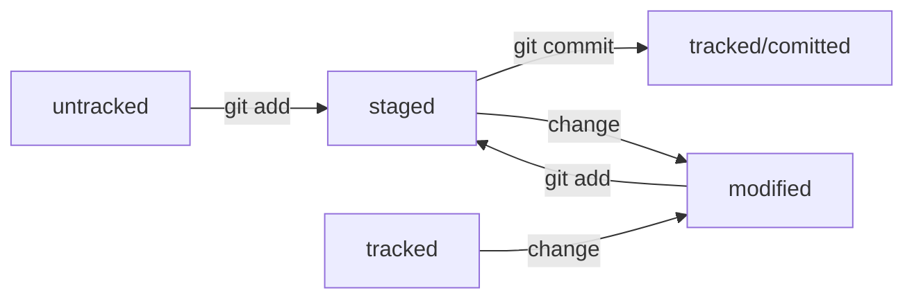

## Git — это система контроля версий, которая помогает отслеживать изменения в проекте.

---

# Команды

* __git init__ - сделать папку репрезиторием

* __rm -rf .git__ - "разгитить" папку

* __git status__ - проверка состояния репрезитория

* __git add__ - добавление файлов в репрезиторий 

* __git add --all__ - добавиление всех файлов в репрезиторий 

* __git add .__ - добавление в репрезиторий текущей папки с файлами 

* __git commit__ - выполнение коммита

* __git log__ - просмотр истории коммитов

* __git remote add__ - связать удаленный репрезиторий с локальным

* __git remote -v__ - проверка связи между репрезиториями 

* __git push__ - отправка изменений на удаленный репрезитоирий 

* __git log --oneline__ - получение сокращенного лога

---

## GitHub — платформа для хранения IT-проектов и совместной работы над ними с использованием Git.

---

|Git                                               |GitHub                                           |
|:------------------------------------------------:|:-----------------------------------------------:|
|консольный инструмент для работы с репризиториями |платформа для размещения удалённых репозиториев  |
|проект с открытым исходным кодом                  |принадлежит компании Microsoft                   |

---

# SSH-key

* SSH — протокол, который обеспечивает безопасный обмен данными в сети и использует для этого ключи

* SSH-ключ — ваш виртуальный идентификатор в GitHub

* SSH-ключ состоит из двух частей — публичной и приватной. Публичный ключ зашифрует данные, а приватный — расшифрует

## Хеш — основной идентификатор коммита.

---

* Git преобразует информацию о коммитах с помощью алгоритма SHA-1 и для каждого из них рассчитывает уникальный идентификатор — хеш

* Хеш — основной идентификатор коммита и позволяет узнать его автора, дату и содержимое закоммиченных файлов

* Все хеши, а также таблицу соответствий хеш → информация о коммите Git хранит в папке .git

---

# Элементы описания коммита 

* строка из цифр и латинских букв после слова commit — это хеш коммита

* __Author__ — имя автора и его электронная почта

* __Date__ — дата и время создания коммита

* в конце находится сообщение коммита

---

## Файл HEAD - один из служебных файлов папки .git, указывает на коммит, который сделан последним.

---

Внутри HEAD — ссылка на служебный файл: refs/heads/master

---

# Типичный жизненный цикл файла в Git

---

1. Файл только что создали. Git про него ещё ничего не знает. Состояние: untracked.

2. Файл добавили в staging area с помощью git add. Состояние: staged (+ tracked).

	* Возможно, изменили файл ещё раз. Состояния: staged, modified (+ tracked).

	* Ещё раз выполнили git add. Состояние: staged (+ tracked).

3. Сделали коммит с помощью git commit. Состояние: tracked.

4. Изменили файл. Состояние: modified (+ tracked).

5. Снова добавили в staging area с помощью git add. Состояния: staged (+ tracked).

6. Сделали коммит. Состояния: tracked.

7. Повторили пункты 4 - 7 много-много раз.

---

---

## Git status - показывает следующие состояния файлов:

* staged (Changes to be committed в выводе git status)

* modified (Changes not staged for commit)

* untracked (Untracked files)

---

## Commit messages 

---

* сообщение коммита легко читается

* оно информативное

* все сообщения оформлены в одном стиле

